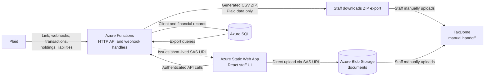

# Meade CPA Financial Data Platform

This is an internal, staff-facing tool for Meade CPA, an accounting and tax firm. It's the intake point for client financial data, pulling bank transactions, holdings, and liabilities data via Plaid, and giving staff one place to upload and manage client documents. Plaid data lives in Azure SQL. Uploaded files live in Azure Blob Storage. From there, staff generate an export and hand it off to TaxDome, the firm's internal source of truth for client records.


## Architecture overview

The React frontend is served by Azure Static Web Apps and calls the Azure Functions HTTP API. Functions use Plaid for bank-linking, webhooks, and financial-data synchronization; Azure SQL for storing client and financial records; and Azure Blob Storage for file content. Staff-uploaded documents are stored in Azure Blob Storage and are manually moved to TaxDome. The export function produces a downloadable ZIP of all client Plaid-sourced financial data. The current TaxDome step is also outside the application: staff download the export and manually move the required files into TaxDome. The high-level data direction is shown below. 


### Tech stack

- Frontend: React, TypeScript, Material-UI
- Backend: Azure Functions, Node.js, TypeScript
- Database: Azure SQL Database (Serverless tier), Azure Blob Storage
- Authentication: Azure Static Web Apps built-in auth (Entra ID as identity provider)
- Infrastructure: Azure Static Web Apps, GitHub Actions CI/CD

## Core features

### Connect a client's bank

- Send a Plaid Hosted Link to a client to connect to a bank, or send an update link for an existing bank connection.
- Track pending, expired, failed, and incomplete link sessions, including suggested staff action.
- View connection status and alerts for login-required, needs-update, error, and pending-sync states.
- Remove a bank connection, optionally invalidating the Plaid connection.

### Review synchronized financial data

- View accounts and balances for each connected Plaid Item (bank).
- Browse transactions, including pending status, merchant details, Plaid categories, and categorization confidence levels.
- Manually categorize and verify transactions that need review.
- Trigger a transaction sync or request a refresh for a connection.
- View investment holdings, securities, investment transactions, and calculated portfolio details where available.
- View credit-card, student-loan, and mortgage liability data, including credit APR details where available.

### Upload and manage documents

- Drag and drop or browse for multiple files on a client's detail page.
- Upload files directly from the browser to the `documents` Azure Blob container using a short-lived, write-only SAS URL.

### Export client data

- Download a ZIP for a client from the client detail page.
- The ZIP includes `client_info.csv` and per-bank CSVs for accounts, transactions, credit/student/mortgage liabilities, holdings, and investment transactions.
- Staff use this download as the financial-data portion of the manual TaxDome handoff.

## Data flow

### Plaid to Azure SQL

1. Staff create or select a client and request a link token from `/api/plaid/link-token`.
2. The client completes Plaid Hosted Link. Plaid sends `SESSION_FINISHED` to `/api/plaid/webhook`; the handler exchanges the public token, encrypts the access token, and creates or updates the Plaid Item and its accounts.
3. Plaid sends webhooks when transaction, liability, investment, account, or connection state changes. The webhook handler records the event, updates Item status, and marks transaction updates available or starts the relevant sync work.
4. Transaction sync uses Plaid's cursor-based `/transactions/sync` flow and writes additions, changes, removals to transaction data to Azure SQL. 
5. Staff view the resulting records through the client detail page. The UI can also request an explicit transaction sync or refresh.

### Documents and export to TaxDome

For a document, the browser requests `/api/upload-url`, uploads directly to Blob Storage, computes a SHA-256 hash, and calls `POST /api/documents`. The API verifies that the blob exists, rejects duplicate content for the same client and tax year, and records the document metadata in Azure SQL. Separately, `GET /api/export-client-data` queries Azure SQL and streams a ZIP of Plaid-derived CSVs to the browser. Staff currently download the ZIP and manually upload the required export and document files into TaxDome. 

## Database schema

- **Client identity and external references:** `clients` stores the internal integer ID, durable UUID, contact/business/tax-profile fields, sync state, Plaid user ID, and archive state.
- **Bank connections and link history:** `items` stores Plaid Items, encrypted access tokens and key IDs, institution/status/error state, consent and transaction cursors, and transaction/investment/liability sync timestamps. `accounts` stores the accounts under each Item and their balances and reporting flags. `link_tokens` stores one row per hosted-link attempt, including its status, expiration, and the most recent session outcome. `link_sessions` stores the full history of individual session events tied to each token.
- **Plaid financial data:** `transactions` stores transaction identity, dates, merchant and amount data, Plaid/manual categories, confidence and verification state, processing state, and archive fields. `securities`, `holdings`, and `investment_transactions` store investment reference data, positions, and activity. `liabilities_credit` plus `liabilities_credit_aprs`, `liabilities_student`, and `liabilities_mortgage` store the supported liability types and their tax/payment details.
- **Documents and exports:** `documents` stores document UUIDs, client UUIDs, tax years, Blob paths, filenames, sizes, hashes, uploader identity, and upload timestamps. 
- **Security and audit:** `encryption_keys` stores the keys used to encrypt Plaid access tokens; `webhook_log` records Plaid webhook payloads and processing state. Soft-archive/status fields are also used throughout the financial tables.

## Security

This app uses two independent layers of protection, not just one:

1. **Edge gate** — Azure Static Web Apps applies an Entra ID login requirement to the frontend and to all protected `/api/*` routes, before a request ever reaches application code.
2. **In-code check** — every protected Function independently verifies the `x-ms-client-principal` header itself, rather than trusting the edge gate alone.

**Two routes are deliberately public, by design:**
- `/api/ping` — a basic health check
- `/api/plaid/webhook` — must stay open since Plaid, not a logged-in staff member, calls it. Instead of the staff principal check, this endpoint verifies Plaid's own signed JWT, confirms a SHA-256 hash of the request body matches what Plaid signed, and rejects anything older than a few minutes to prevent replay.

Plaid access tokens are stored encrypted, with the encryption keys held in the `encryption_keys` table.

## Environments

**Local development** runs the React app with `npm start` in `frontend` and the Functions host with `npm start` in `api` (`func start` after the API's `prestart` TypeScript build). The dev container installs both dependency sets and Azure Functions Core Tools. 

**Deployed development/production path** is the Azure Static Web App workflow. A push to `main` builds `frontend` with `npm ci && npm run build`, then deploys the prebuilt `frontend/build` and builds the Functions API with `npm ci && npm run build`. The deployed Static Web Apps route rules require authentication for the app and `/api/*`, except for `/api/ping`, `/api/plaid/webhook`, and `/bank/link-complete`.

## Getting started

The checked-in dev-container setup installs dependencies with these commands:

```bash
npm install --prefix frontend
npm install --prefix api
npm install -g azure-functions-core-tools@4 --unsafe-perm true
```

Configure local API settings securely, including `AZURE_SQL_CONNECTION_STRING`, `AZURE_STORAGE_CONNECTION_STRING`, `PLAID_CLIENT_ID`, `PLAID_SECRET`, `PLAID_ENV`, and the other values required by the Functions.

Start the two processes in separate terminals:

```bash
cd api
npm start
```

```bash
cd frontend
npm start
```

The frontend development server runs at `http://localhost:3000`; the Functions host uses the default Azure Functions Core Tools local address. The API can also be built and tested with `npm run build` and `npm test` from `api`; the frontend provides `npm run build` and `npm test`.

## Known limitations

- TaxDome's public API is currently in private beta. The manual TaxDome handoff is deliberate: staff download the financial-data ZIP and move the needed files into TaxDome by hand. The export boundary is intended to be replaceable with a future automated push.